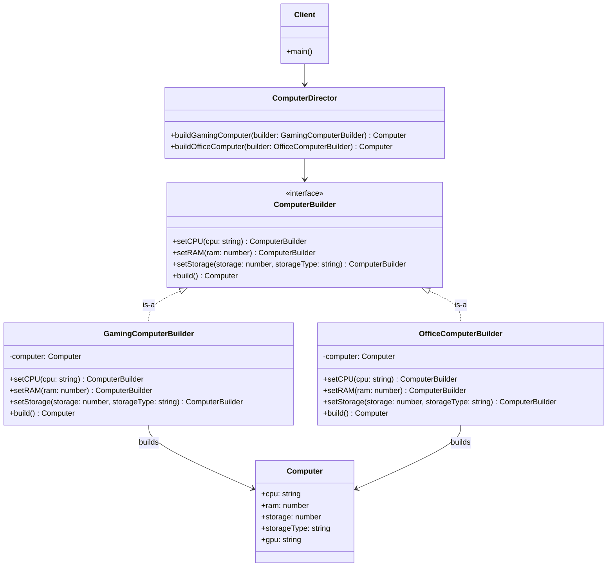

# Builder Pattern

Construct large object step by step as a cutomizable

```mermaid
classDiagram

class Client {
    +main()
}

class ComputerDirector {
    +buildGamingComputer(builder: GamingComputerBuilder) Computer
    +buildOfficeComputer(builder: OfficeComputerBuilder) Computer
}

class ComputerBuilder {
    <<interface>>
    +setCPU(cpu: string) ComputerBuilder
    +setRAM(ram: number) ComputerBuilder
    +setStorage(storage: number, storageType: string) ComputerBuilder
    +build() Computer
}

class GamingComputerBuilder {
    -computer: Computer
    +setCPU(cpu: string) ComputerBuilder
    +setRAM(ram: number) ComputerBuilder
    +setStorage(storage: number, storageType: string) ComputerBuilder
    +build() Computer
}

class OfficeComputerBuilder {
    -computer: Computer
    +setCPU(cpu: string) ComputerBuilder
    +setRAM(ram: number) ComputerBuilder
    +setStorage(storage: number, storageType: string) ComputerBuilder
    +build() Computer
}

class Computer {
    +cpu: string
    +ram: number
    +storage: number
    +storageType: string
    +gpu: string
}

ComputerBuilder <|.. GamingComputerBuilder : is-a
ComputerBuilder <|.. OfficeComputerBuilder : is-a

GamingComputerBuilder --> Computer : builds
OfficeComputerBuilder --> Computer : builds

ComputerDirector --> ComputerBuilder

Client --> ComputerDirector
```
